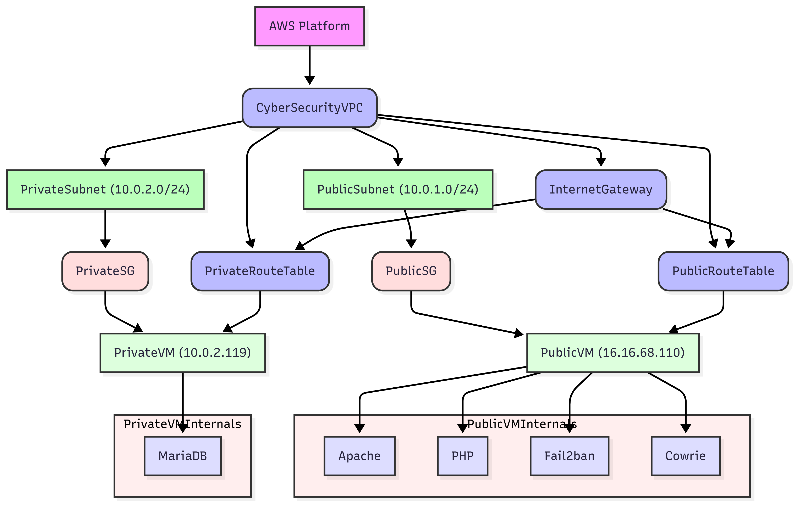

# Secure AWS Web Application Deployment with EC2, VPC, Apache, MariaDB, Fail2ban & Cowrie

This repository documents a comprehensive AWS-based security project, demonstrating the step-by-step setup of a secure, two-tier web application architecture using EC2 instances, a Virtual Private Cloud (VPC), and advanced security hardening techniques. The focus was on secure deployment, logging, and attack detection.

> 🛠️ **Note:** This repository primarily contains documentation, configuration files, Python analysis scripts, and screenshots that visually support the implementation process.

---

## 🧱 Architecture Overview

This diagram summarizes the full AWS setup for the project:




- **CyberSecurityVPC** (CIDR: `10.0.0.0/16`)
  - **PublicSubnet** (`10.0.1.0/24`)
    - EC2 Instance: `PublicVM` (Apache, PHP, Cowrie, Fail2ban)
  - **PrivateSubnet** (`10.0.2.0/24`)
    - EC2 Instance: `PrivateVM` (MariaDB)
- **Internet Gateway (CyberIGW)** with route tables for public/private routing
- **Security Groups**
  - `PublicSG`: Allows SSH, HTTP, HTTPS
  - `PrivateSG`: Allows SSH and MariaDB (TCP 3306) only from the public subnet

---

## 🔐 Key Security Features

- **MFA-enabled AWS account** (Free Tier)
- **Isolated network setup** with public/private subnets
- **Fail2ban** to prevent brute-force SSH/HTTP attacks
- **Cowrie honeypot** to detect and log malicious SSH attempts
- **MariaDB** in private subnet with limited access
- **No direct access to private resources from the internet**

---

## 📸 What's Included

- `screenshots/`: Visual documentation of all major steps (AWS console, CLI, configuration)
- `cowrie/`:
  - `analyze_logins.py`: Extract login data from Cowrie logs
  - `plot_logins.py`: Generate attack pattern visualization (`login_attempts.png`)
  - `login_attempts.json`: Raw extracted login attempt data
- `index.php`: Simple PHP contact form that interacts with MariaDB
- `mariadb-server.cnf`: Database server configuration
- `jail.local`: Fail2ban configuration for `sshd` and `apache-auth`

---

## 🌐 Access & Usage

- Access the **PHP contact form** via:  
  `http://<your-public-IP>` (e.g., `http://13.49.78.207`)

- Test MariaDB integration:  
  Use `SELECT * FROM messages;` to view submitted form data.

- Monitor Fail2ban protection:  
  ```bash
  sudo fail2ban-client status
- Monitor Cowrie logs:
bash
tail -f ~/cowrie/var/log/cowrie/cowrie.log
- Analyze honeypot data:
bash
python3 cowrie/analyze_logins.py
python3 cowrie/plot_logins.py

📚 Project Highlights
✅ Created and configured:

 * VPC, subnets, routing, and IGW

 * Public/private EC2 instances with tailored security groups

 * Apache + PHP + MariaDB full-stack web app

 * Secure SSH access flow via bastion (public EC2 → private EC2)

 * Cowrie honeypot for real-world SSH attack monitoring

 * Fail2ban service for active intrusion prevention

🧠 Lessons Learned
 * This project deepened hands-on experience in:

 * AWS infrastructure setup and segmentation

 * Linux server configuration and web app deployment

 * Network isolation and secure access patterns

 * Intrusion detection and log analysis

 * Real-time protection using Fail2ban
